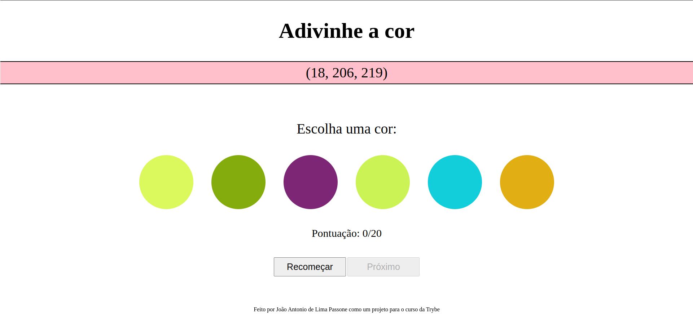

# Projeto Color Guess - Trybe

Jogo criado como projeto para a Trybe, onde o jogador precisa acertar a cor de acordo com o código RGB mostrado na tela.  
[Clique aqui para jogar](https://joaopassone.github.io/projetos/color-guess/index.html)

## O que foi utilizado?

## Sobre

O jogo mostra um código de cor RGB na tela e 6 opções de cores geradas aleatoriamente para que o jogador possa tentar acertar. As regras são as seguintes:
- O jogador pode chutar quantas vezes quiser até acertar a cor durante a rodada;
- Cada acerto dá 3 pontos ao jogador;
- Cada erro retira 2 pontos do jogador;
- O jogador vence ao completar 20 pontos.

##
